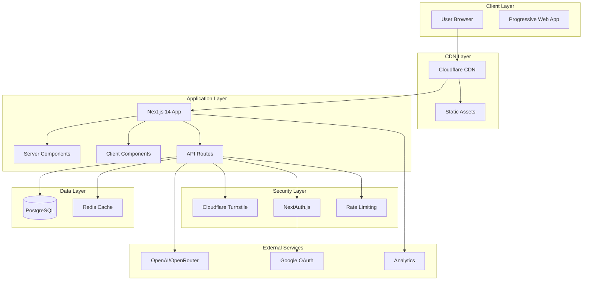
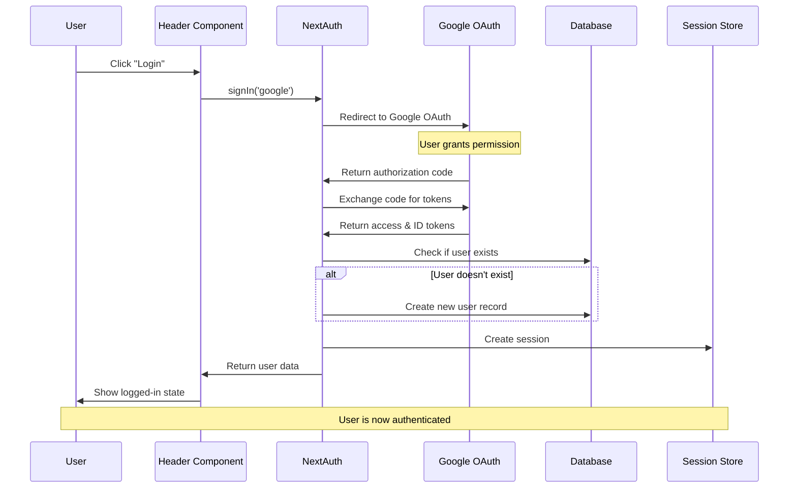
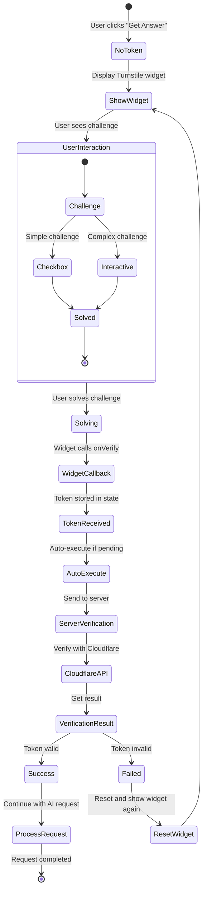
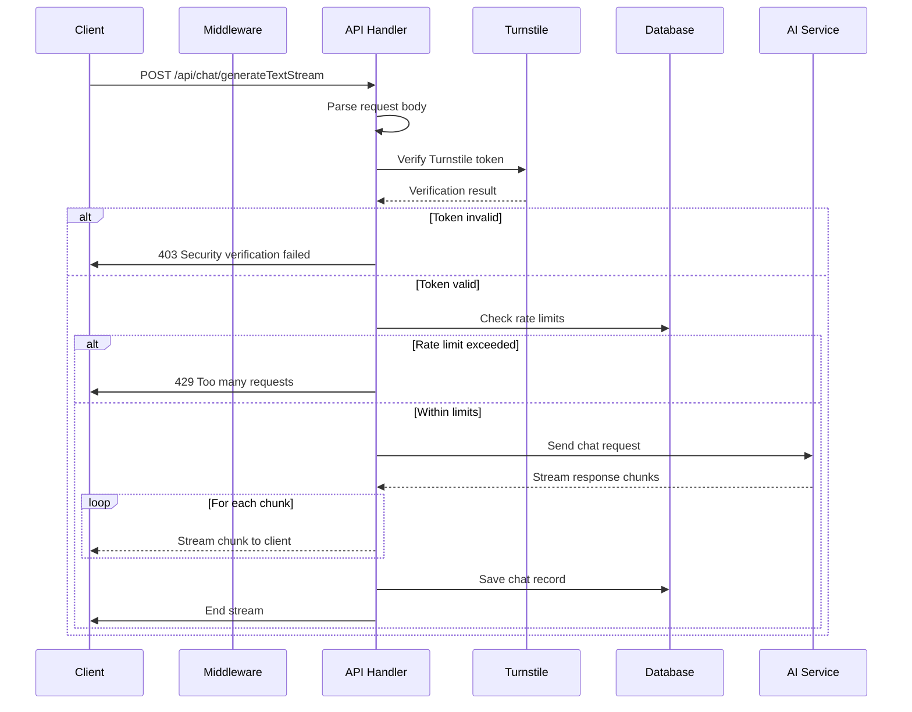
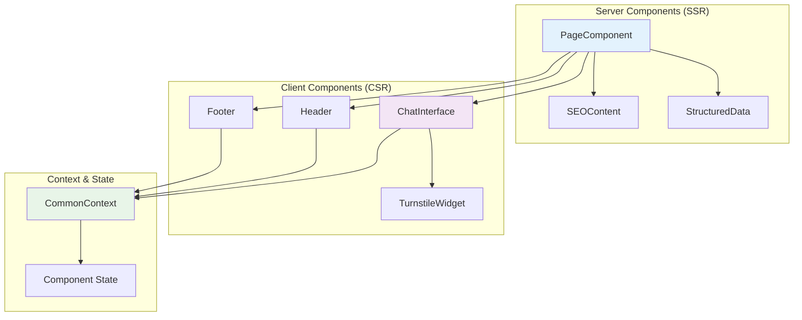
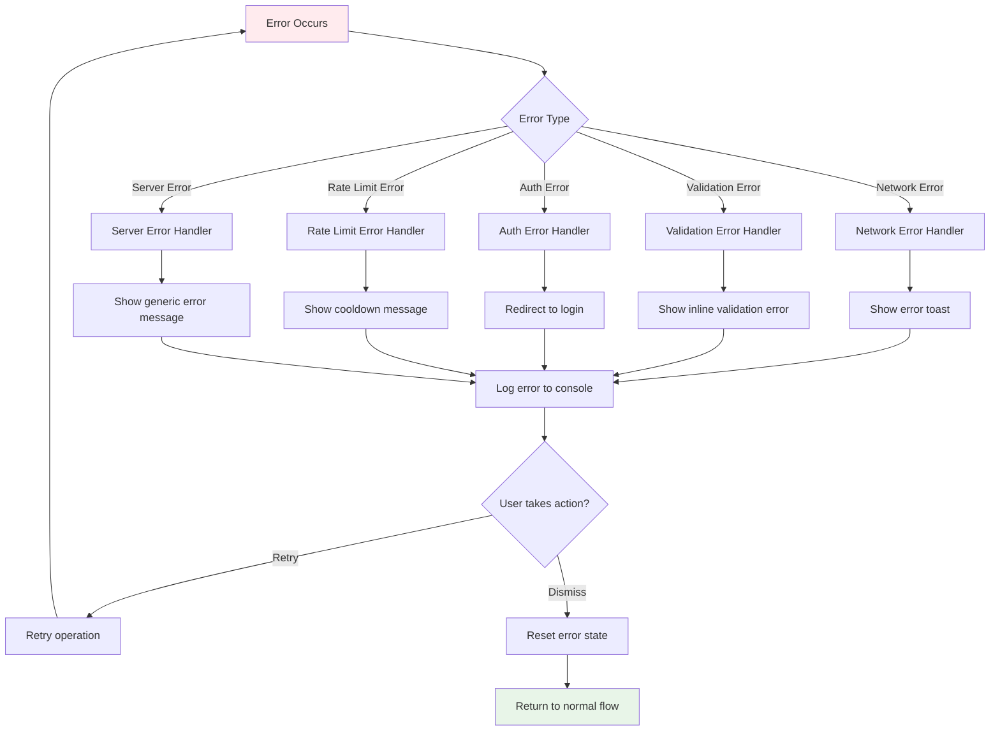
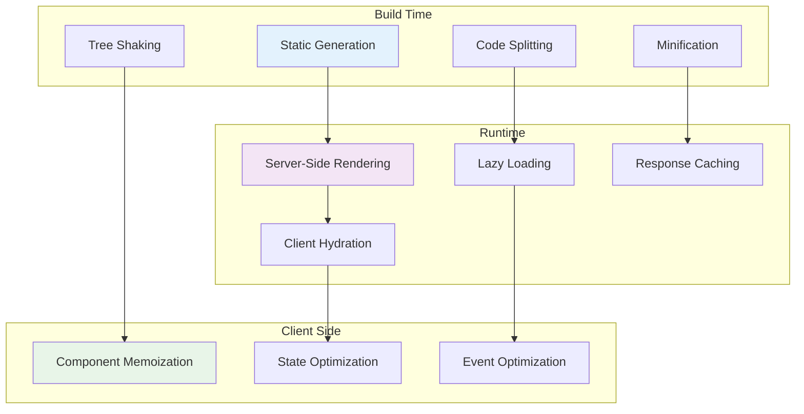

# Vibe Coding - Flow Diagrams

## 🔄 System Flow Diagrams

### 1. Overall System Architecture



### 2. User Journey Flow

```mermaid
flowchart TD
    Start([User visits site]) --> Load[Page loads with SSR content]
    Load --> Input[User enters coding question]
    Input --> Click[User clicks "Get Code Help"]
    
    Click --> CheckAuth{Authentication required?}
    CheckAuth -->|Yes| Login[Show login modal]
    CheckAuth -->|No| CheckToken{Has Turnstile token?}
    
    Login --> OAuth[Google OAuth flow]
    OAuth --> CheckToken
    
    CheckToken -->|No| ShowTurnstile[Display Turnstile widget]
    CheckToken -->|Yes| SendRequest[Send API request]
    
    ShowTurnstile --> UserVerify[User completes verification]
    UserVerify --> VerifySuccess{Verification successful?}
    VerifySuccess -->|No| ShowError[Show error message]
    VerifySuccess -->|Yes| AutoExecute[Auto-execute generation]
    
    ShowError --> ShowTurnstile
    AutoExecute --> SendRequest
    
    SendRequest --> ServerVerify[Server verifies token]
    ServerVerify --> RateCheck[Check rate limits]
    RateCheck --> AIRequest[Send request to AI]
    
    AIRequest --> StreamResponse[Stream AI response]
    StreamResponse --> DisplayResult[Display result to user]
    DisplayResult --> SaveChat[Save chat to database]
    SaveChat --> End([End])
    
    style Start fill:#e1f5fe
    style End fill:#e8f5e8
    style ShowError fill:#ffebee
```

### 3. Authentication Flow



### 4. Chat Generation Flow

```mermaid
flowchart TD
    UserInput[User enters question] --> ValidateInput{Input valid?}
    ValidateInput -->|No| ShowError[Show validation error]
    ValidateInput -->|Yes| CheckAuth{Auth required?}
    
    CheckAuth -->|Yes| IsLoggedIn{User logged in?}
    CheckAuth -->|No| CheckTurnstile{Has Turnstile token?}
    
    IsLoggedIn -->|No| ShowLogin[Show login modal]
    IsLoggedIn -->|Yes| CheckTurnstile
    
    ShowLogin --> LoginFlow[Google OAuth flow]
    LoginFlow --> CheckTurnstile
    
    CheckTurnstile -->|No| ShowTurnstile[Display Turnstile]
    CheckTurnstile -->|Yes| PrepareRequest[Prepare API request]
    
    ShowTurnstile --> UserVerifies[User completes verification]
    UserVerifies --> TurnstileCallback[onVerify callback]
    TurnstileCallback --> SetToken[Set turnstile token]
    SetToken --> AutoExecute[Auto-execute if pending]
    AutoExecute --> PrepareRequest
    
    PrepareRequest --> SendAPI[POST /api/chat/generateTextStream]
    SendAPI --> ServerValidation[Server-side validation]
    
    ServerValidation --> VerifyTurnstile[Verify Turnstile token]
    VerifyTurnstile --> CheckRateLimit[Check rate limits]
    CheckRateLimit --> CallAI[Call AI service]
    
    CallAI --> StreamStart[Start streaming response]
    StreamStart --> ProcessChunk[Process response chunk]
    ProcessChunk --> UpdateUI[Update UI with chunk]
    UpdateUI --> MoreChunks{More chunks?}
    
    MoreChunks -->|Yes| ProcessChunk
    MoreChunks -->|No| StreamComplete[Stream complete]
    
    StreamComplete --> SaveToDB[Save chat to database]
    SaveToDB --> ResetState[Reset component state]
    ResetState --> Complete[Generation complete]
    
    style UserInput fill:#e3f2fd
    style Complete fill:#e8f5e8
    style ShowError fill:#ffebee
```



### 5. Security Verification Flow



### 6. Database Operations Flow

```mermaid
flowchart LR
    subgraph "User Management"
        CreateUser[Create User] --> UserDB[(users table)]
        GetUser[Get User] --> UserDB
        UpdateUser[Update User] --> UserDB
    end
    
    subgraph "Chat Management"
        SaveChat[Save Chat] --> ChatDB[(chat_record table)]
        GetHistory[Get History] --> ChatDB
        GetPublic[Get Public Chats] --> ChatDB
    end
    
    subgraph "Session Management"
        CreateSession[Create Session] --> SessionDB[(sessions table)]
        ValidateSession[Validate Session] --> SessionDB
        CleanupSessions[Cleanup Expired] --> SessionDB
    end
    
    UserDB --> ChatDB: user_id reference
    UserDB --> SessionDB: user_id reference
    
    style UserDB fill:#e1f5fe
    style ChatDB fill:#f3e5f5
    style SessionDB fill:#e8f5e8
```

### 7. API Request/Response Flow



### 8. Component Interaction Flow



### 9. Internationalization Flow

```mermaid
flowchart TD
    UserVisit[User visits site] --> DetectLocale{Detect locale from URL}
    DetectLocale -->|/en or /| EnglishFlow[Load English content]
    DetectLocale -->|/zh| ChineseFlow[Load Chinese content]
    
    EnglishFlow --> LoadEnMessages[Load messages/en.json]
    ChineseFlow --> LoadZhMessages[Load messages/zh.json]
    
    LoadEnMessages --> ServerRender[Server-side rendering]
    LoadZhMessages --> ServerRender
    
    ServerRender --> GetTexts[getCommonText(), getIndexPageText()]
    GetTexts --> RenderComponents[Render components with localized text]
    RenderComponents --> ClientHydration[Client-side hydration]
    
    ClientHydration --> ContextProvider[CommonContext provides text]
    ContextProvider --> ComponentsUseText[Components use localized text]
    
    style EnglishFlow fill:#e3f2fd
    style ChineseFlow fill:#fff3e0
    style ServerRender fill:#e8f5e8
```

### 10. Error Handling Flow



### 11. Performance Optimization Flow



## 📊 Data Flow Summary

### Key Data Flows:
1. **User Input → AI Response**: Main chat functionality
2. **Authentication → Session**: User login and session management
3. **Security Verification → Request Processing**: Turnstile integration
4. **Localization → Content Rendering**: Multi-language support
5. **Error Handling → User Feedback**: Comprehensive error management

### Performance Considerations:
- Server-side rendering for SEO and initial load speed
- Client-side hydration for interactivity
- Streaming responses for real-time AI feedback
- Component memoization for re-render optimization
- Code splitting for reduced bundle sizes

These flow diagrams provide a comprehensive view of how the Vibe Coding platform operates, from high-level architecture to detailed component interactions.