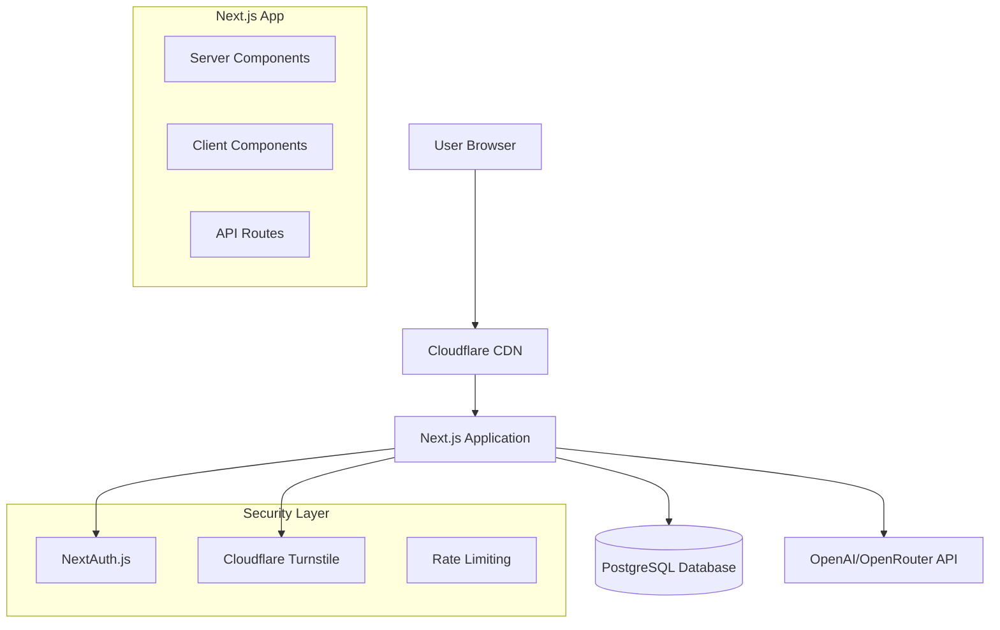
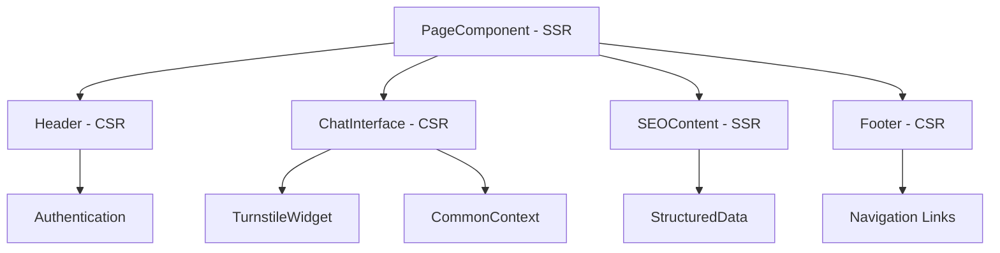
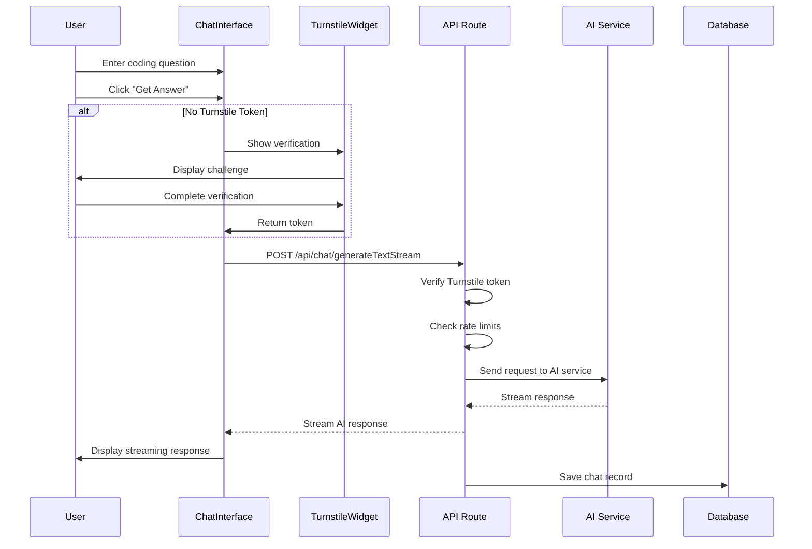
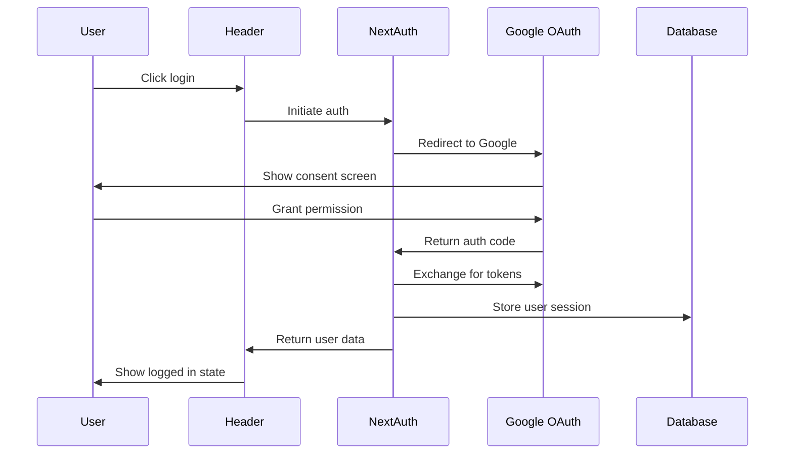

# Vibe Coding - Technical Documentation

## 🏗 System Architecture

### High-Level Architecture



### Component Architecture



## 🔄 Data Flow

### User Request Flow



### Authentication Flow



## 🗄 Database Schema

### Core Tables

```sql
-- Users table
CREATE TABLE users (
    id SERIAL PRIMARY KEY,
    email VARCHAR(255) UNIQUE NOT NULL,
    name VARCHAR(255),
    image VARCHAR(255),
    created_at TIMESTAMP DEFAULT CURRENT_TIMESTAMP,
    updated_at TIMESTAMP DEFAULT CURRENT_TIMESTAMP
);

-- Chat records table
CREATE TABLE chat_record (
    id SERIAL PRIMARY KEY,
    uid VARCHAR(255) UNIQUE NOT NULL,
    user_id INTEGER REFERENCES users(id),
    input_text TEXT NOT NULL,
    output_text TEXT,
    title VARCHAR(255),
    language VARCHAR(10) DEFAULT 'en',
    created_at TIMESTAMP DEFAULT CURRENT_TIMESTAMP,
    updated_at TIMESTAMP DEFAULT CURRENT_TIMESTAMP
);

-- Sessions table (NextAuth)
CREATE TABLE sessions (
    id SERIAL PRIMARY KEY,
    session_token VARCHAR(255) UNIQUE NOT NULL,
    user_id INTEGER REFERENCES users(id),
    expires TIMESTAMP NOT NULL,
    created_at TIMESTAMP DEFAULT CURRENT_TIMESTAMP
);
```

## 🔧 API Documentation

### Chat API

#### POST `/api/chat/generateTextStream`

Generate AI response for coding questions with streaming.

**Request Body:**
```json
{
  "textStr": "How to implement a binary search in Python?",
  "user_id": 123,
  "turnstileToken": "turnstile_token_here"
}
```

**Response:**
- Content-Type: `text/plain; charset=utf-8`
- Streaming response with AI-generated content

**Error Responses:**
- `401`: Authentication required
- `403`: Security verification failed
- `429`: Rate limit exceeded

#### POST `/api/chat/saveText`

Save chat conversation to database.

**Request Body:**
```json
{
  "input_text": "User question",
  "output_text": "AI response",
  "user_id": 123
}
```

### Turnstile API

#### POST `/api/turnstile/verify`

Verify Cloudflare Turnstile token.

**Request Body:**
```json
{
  "token": "turnstile_response_token"
}
```

**Response:**
```json
{
  "success": true
}
```

### User API

#### GET `/api/user/getUserByEmail`

Get user information by email.

**Query Parameters:**
- `email`: User email address

#### GET `/api/user/getUserByUserId`

Get user information by user ID.

**Query Parameters:**
- `user_id`: User ID

## 🎨 Component Documentation

### ChatInterface Component

**Purpose:** Main chat interface for user interactions

**Props:**
```typescript
interface ChatInterfaceProps {
  commonText: any; // Localized text content
}
```

**Key Features:**
- Real-time AI response streaming
- Turnstile security integration
- Auto-execution after verification
- Local storage for input persistence

**State Management:**
```typescript
const [textStr, setTextStr] = useState(''); // User input
const [resStr, setResStr] = useState(''); // AI response
const [turnstileToken, setTurnstileToken] = useState<string | null>(null);
const [showTurnstile, setShowTurnstile] = useState(false);
const [pendingGeneration, setPendingGeneration] = useState(false);
```

### TurnstileWidget Component

**Purpose:** Cloudflare Turnstile integration for bot protection

**Props:**
```typescript
interface TurnstileWidgetProps {
  onVerify?: (token: string) => void;
  onError?: () => void;
  onExpire?: () => void;
}
```

**Ref Interface:**
```typescript
interface TurnstileRef {
  getToken: () => string | null;
  reset: () => void;
}
```

### SEOContent Component

**Purpose:** SEO-optimized content sections

**Features:**
- About section with product description
- Feature cards with icons and descriptions
- FAQ section with structured data
- Responsive design with Tailwind CSS

## 🌐 Internationalization

### Configuration

**Supported Locales:**
- `en` (English) - Default
- `zh` (Chinese Simplified)

**File Structure:**
```
messages/
├── en.json    # English translations
└── zh.json    # Chinese translations
```

**Usage Example:**
```typescript
// In server components
const commonText = await getCommonText();

// In client components
const { commonText } = useCommonContext();
```

### Translation Keys Structure

```json
{
  "CommonText": {
    "loadingText": "Loading...",
    "placeholderText": "Type or paste code",
    "buttonText": "Generate"
  },
  "CommonTextAddition": {
    "getAnswerText": "Get Code Help",
    "answerText": "Solution",
    "aboutTitle": "About Vibe Coding"
  }
}
```

## 🔒 Security Implementation

### Turnstile Integration

**Client-Side:**
```typescript
// TurnstileWidget component
<Turnstile
  siteKey={process.env.NEXT_PUBLIC_TURNSTILE_SITE_KEY}
  onSuccess={onVerify}
  onError={onError}
  onExpire={onExpire}
/>
```

**Server-Side Verification:**
```typescript
async function verifyTurnstile(token: string): Promise<boolean> {
  const response = await fetch('https://challenges.cloudflare.com/turnstile/v0/siteverify', {
    method: 'POST',
    headers: { 'Content-Type': 'application/x-www-form-urlencoded' },
    body: new URLSearchParams({
      secret: process.env.TURNSTILE_SECRET_KEY,
      response: token,
    }),
  });
  
  const result = await response.json();
  return result.success;
}
```

### Rate Limiting

**Implementation:**
```typescript
// Check user's last request time
const {rows: existListByUser} = await db.query(
  'select created_at from chat_record where user_id=$1 order by created_at desc limit 1',
  [user_id]
);

if (existListByUser.length > 0) {
  const existTime = new Date(existListByUser[0].created_at).getTime();
  const currentTime = new Date().getTime();
  const resultTime = (currentTime - existTime) / 1000;
  
  if (resultTime < 30) {
    return new Response("Requested too frequently!", { status: 429 });
  }
}
```

## 📊 SEO Implementation

### Structured Data

**Organization Schema:**
```json
{
  "@context": "https://schema.org",
  "@type": "Organization",
  "name": "Vibe Coding",
  "url": "https://vibecoding.com",
  "description": "AI-powered coding assistant"
}
```

**FAQ Schema:**
```json
{
  "@context": "https://schema.org",
  "@type": "FAQPage",
  "mainEntity": [
    {
      "@type": "Question",
      "name": "What programming languages does Vibe Coding support?",
      "acceptedAnswer": {
        "@type": "Answer",
        "text": "Vibe Coding supports all major programming languages..."
      }
    }
  ]
}
```

### Meta Tags

**Dynamic Meta Tags:**
```typescript
// HeadInfo component
<title>{title}</title>
<meta name="description" content={description} />
<link rel="canonical" href={canonicalUrl} />
<link rel="alternate" hrefLang="en" href={enUrl} />
<link rel="alternate" hrefLang="zh" href={zhUrl} />
```

## 🚀 Performance Optimization

### Server-Side Rendering

**Strategy:**
- Static content rendered on server
- Interactive components hydrated on client
- Streaming for real-time responses

**Implementation:**
```typescript
// Server Component (PageComponent)
const PageComponent = async ({ locale, indexText, commonText }) => {
  return (
    <>
      {/* Static content */}
      <SEOContent commonText={commonText} />
      
      {/* Interactive component */}
      <ChatInterface commonText={commonText} />
    </>
  );
};
```

### Code Splitting

**Automatic Splitting:**
- Next.js automatically splits code by routes
- Dynamic imports for heavy components
- Lazy loading for non-critical features

### Caching Strategy

**Static Assets:**
- CDN caching for images and static files
- Browser caching with proper headers

**API Responses:**
- Database query optimization
- Response caching where appropriate

## 🧪 Testing Strategy

### Unit Testing
```typescript
// Component testing example
import { render, screen } from '@testing-library/react';
import ChatInterface from '../ChatInterface';

test('renders chat interface', () => {
  render(<ChatInterface commonText={mockText} />);
  expect(screen.getByPlaceholderText(/type or paste/i)).toBeInTheDocument();
});
```

### Integration Testing
```typescript
// API testing example
import { POST } from '../api/chat/generateTextStream/route';

test('generates AI response', async () => {
  const request = new Request('http://localhost/api/chat/generateTextStream', {
    method: 'POST',
    body: JSON.stringify({
      textStr: 'test question',
      turnstileToken: 'valid_token'
    })
  });
  
  const response = await POST(request);
  expect(response.status).toBe(200);
});
```

## 🔧 Development Workflow

### Local Development
1. Install dependencies: `npm install`
2. Set up environment variables
3. Start development server: `npm run dev`
4. Access at `http://localhost:3000`

### Code Quality
- ESLint for code linting
- TypeScript for type checking
- Prettier for code formatting

### Git Workflow
1. Feature branches from `main`
2. Pull request reviews
3. Automated testing on PR
4. Merge to `main` after approval

## 📦 Deployment

### Vercel Deployment
```bash
# Build and deploy
npm run build
vercel --prod
```

### Environment Variables
- Set production environment variables in Vercel dashboard
- Configure domain and SSL certificates
- Set up monitoring and analytics

### Database Migration
```sql
-- Run migration scripts
-- Update database schema as needed
-- Backup before major changes
```

This technical documentation provides a comprehensive overview of the Vibe Coding platform's architecture, implementation details, and development practices.